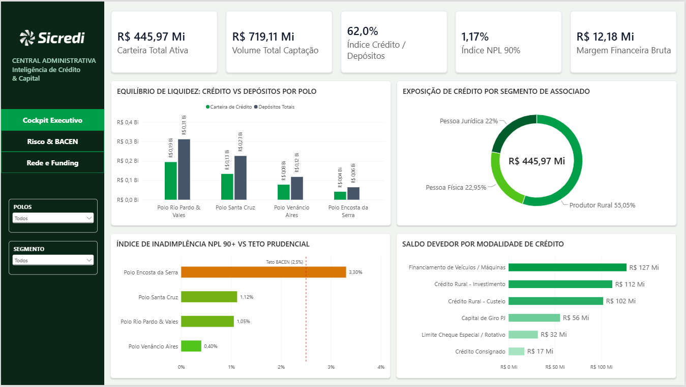
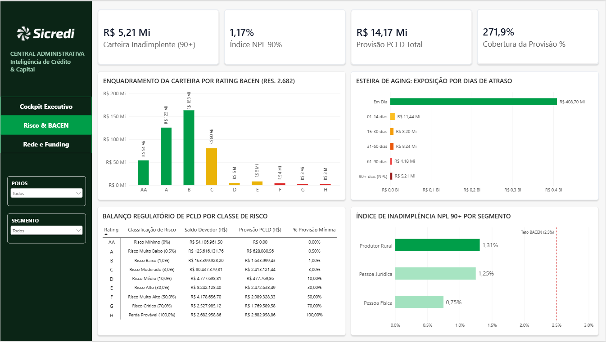
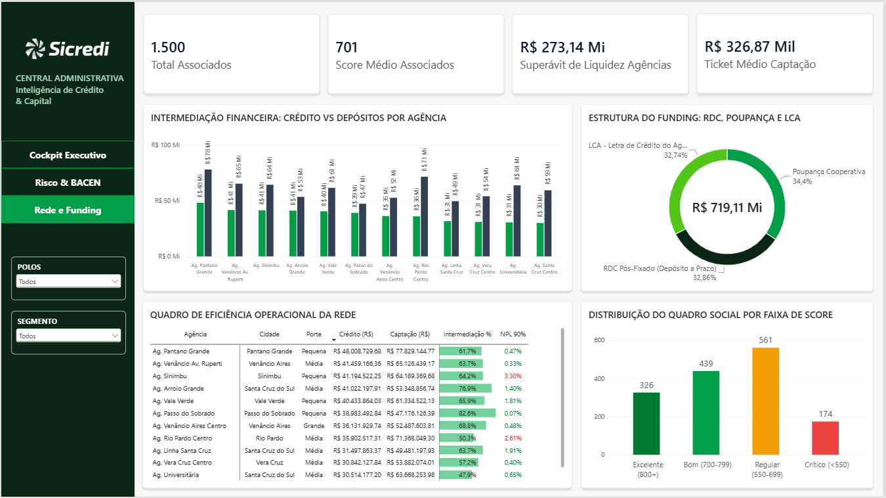

# Gestão de Crédito, Risco e Liquidez - Cooperativa de Crédito

> **Nota do Projeto:** Estudo de caso prático desenvolvido como demonstração técnica de engenharia de dados e modelagem dimensional aplicada ao setor financeiro cooperativo, simulando os desafios de controladoria, risco e liquidez de uma Sede Regional no Vale do Rio Pardo. Os dados são 100% sintéticos, em conformidade com as diretrizes de sigilo bancário e LGPD.

Painel analítico desenvolvido para acompanhamento de carteira de crédito, liquidez e risco regulatório (BACEN) da rede de agências da região de Santa Cruz do Sul e Vale do Rio Pardo.

---

## Acesso ao Dashboard

🔗 **[Acessar o Relatório Interativo no Power BI Service](https://app.powerbi.com/view?r=eyJrIjoiNzhkNzliMTMtMjRhYi00MTRhLWEwNzEtYzI1OWFhOTQwMTg1IiwidCI6ImRmN2Q2NTBkLWMyNmMtNDVhOC1hYjZhLTQwNTNhOGRhNDk5MCJ9)**

---

## Objetivo e Contexto de Negócio

Em instituições financeiras cooperativas, a gestão regional precisa equilibrar crescimento comercial com solidez patrimonial. Este painel foi construído para atender à diretoria executiva, comitê de crédito e gestão de risco, respondendo a três necessidades centrais:

1. **Equilíbrio de Liquidez (*Funding*):** Identificar quais agências e polos geram excedente de captação (poupança, RDC e LCA) e quais demandam recursos para sustentar as operações de crédito.
2. **Monitoramento Prudencial (Resolução BACEN 2.682):** Acompanhar a classificação de risco da carteira nos ratings de AA a H, as esteiras de atraso (*aging*) e o nível de provisão para créditos de liquidação duvidosa (PCLD).
3. **Eficiência da Rede e Quadro Social:** Avaliar a produtividade das 12 agências locais e entender o comportamento de risco segmentado por perfil de cooperado (Produtor Rural, Pessoa Jurídica e Pessoa Física).

---

## Estrutura do Relatório

O dashboard é composto por 3 visões complementares:

### 1. Cockpit Executivo
Visão macro voltada para diretoria e tomada de decisão estratégica. Consolida os números gerais da instituição: carteira de crédito ativa, captação total, índice de intermediação financeira e inadimplência sistêmica (NPL 90+).

* **Principais análises:**
  * Relação Crédito vs. Depósitos por polo regional.
  * Composição da carteira por segmento de associado.
  * Inadimplência NPL 90+ comparada ao teto prudencial de 2,5%.
  * Volume financeiro por linha de produto de crédito.

---

### 2. Risco e BACEN
Visão técnica focada em auditoria, controladoria e risco de crédito. Avalia a aderência da cooperativa às regras prudenciais do Banco Central.

* **Principais análises:**
  * Enquadramento da carteira nos 9 ratings oficiais do BACEN (AA a H).
  * Esteira cronológica de aging (dias de atraso), permitindo identificar a migração de contratos para faixas críticas.
  * Matriz regulatória de provisão PCLD com cálculo de cobertura sobre o volume inadimplente.
  * Taxa de inadimplência segmentada por perfil de tomador de crédito.

---

### 3. Rede e Funding
Visão operacional e comercial voltada para a gestão das agências locais e acompanhamento da base de cooperados.

* **Principais análises:**
  * Intermediação financeira agência por agência (superávit ou déficit de liquidez).
  * Estrutura de captação por tipo de investimento (Poupança, RDC e LCA).
  * Matriz comparativa de agências com porte, saldo, percentual de intermediação e indicador de risco.
  * Distribuição do quadro social por faixa de score de crédito.

---

## Arquitetura e Engenharia de Dados

O projeto seguiu a modelagem dimensional Kimball (Star Schema):

* **Origem dos Dados:** Script Python (`scripts/gerar_dados_cooperativa.py`) para geração de dados sintéticos estocásticos, aplicando regras da Resolução BACEN 2.682 e distribuições estatísticas financeiras coerentes com o cooperativismo gaúcho.
* **Modelo no Power BI:**
  * **Tabelas Fato:** `Fatos_Carteira_Credito` (3.500 contratos), `Fatos_Captacao` (2.200 operações de depósito) e `Fatos_Metas_Agencias`.
  * **Tabelas Dimensão:** `Dim_Agencias` (12 agências da região), `Dim_Associados` (1.500 cooperados), `Dim_Produtos`, `Dim_Calendario`, `Dim_Rating_Bacen`, `Dim_Faixa_Atraso` e `Dim_Faixa_Score`.
  * **Relacionamentos:** Todos estruturados em 1:N com filtro unidirecional. A inteligência de tempo padrão do Power BI foi desativada no arquivo para manter o modelo limpo e performático.
* **Métricas em DAX:** Centralizadas na tabela `_Medidas`, categorizadas por pastas temáticas (Carteira, Risco, Captação, Resultado e Eixos Dinâmicos).

---

Para detalhes aprofundados sobre as fórmulas DAX, regras do BACEN e metadados das tabelas, consulte o arquivo [DOCUMENTACAO.md](DOCUMENTACAO.md).

---

## Autor

**Iago Walter**  
Engenheiro de Produção | Business Intelligence & Análise de Dados  
Santa Cruz do Sul / Vera Cruz — RS  
[LinkedIn](https://www.linkedin.com/in/iago-walter/) | [GitHub](https://github.com/iagowalter)
